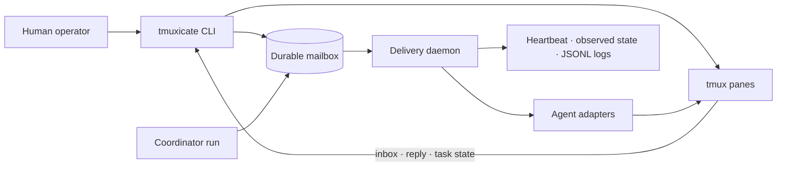

# tmuxicate

[](https://github.com/coyaSONG/tmuxicate/actions/workflows/ci.yml)
[](go.mod)
[](https://github.com/coyaSONG/tmuxicate/stargazers)
[](LICENSE)

Observable multi-agent collaboration in `tmux`, backed by a durable file mailbox.

`tmuxicate` gives each coding agent a pane, role, inbox, and explicit task state. A coordinator can decompose and route work, request reviews, escalate blockers, and keep a durable run record while a human watches or intervenes in the same tmux session.

It is model-vendor neutral: Codex, Claude Code, and generic terminal commands use adapters over the same mailbox protocol. If an agent, daemon, or tmux session stops, coordination state remains on disk.

## Why tmuxicate

- **Observable by default** — panes, transcripts, status, and JSONL events remain available to the operator.
- **Durable coordination** — immutable message bodies and per-recipient receipts use atomic filesystem updates.
- **Explicit ownership** — tasks move through accept, wait, block, and done instead of relying on chat context.
- **Coordinator workflows** — runs, routed child tasks, reviews, and blocker escalation have persisted artifacts.
- **Best-effort notification, reliable reads** — the daemon only injects a short prompt; agents read the canonical message from disk.
- **Vendor-neutral adapters** — coordination semantics do not depend on one agent CLI.

## Architecture



The filesystem under `.tmuxicate/sessions/<session>/` is authoritative. `tmux` is the visible process layer, and pane metadata is auxiliary. Messages are immutable; mutable delivery and task state live in receipt files guarded by locks and atomic renames.

## Quick start

Requirements:

- Go 1.26.1 or a compatible newer toolchain
- `tmux`
- `bash`
- at least one terminal agent command, such as `codex` or `claude`
- optional: `fzf` for `tmuxicate pick`

Install the latest tagged version:

```bash
go install github.com/coyaSONG/tmuxicate/cmd/tmuxicate@latest
```

Create a three-agent configuration and start it:

```bash
tmuxicate init --template triad
tmuxicate up --config tmuxicate.yaml
```

Start a durable coordinator run:

```bash
tmuxicate run "Implement the feature, keep tests green, and obtain reviewer signoff"
```

Or send an ad-hoc message directly to the coordinator alias:

```bash
tmuxicate send pm "Investigate the failing test and report the smallest safe fix."
```

Inspect the team and follow the evidence:

```bash
tmuxicate status
tmuxicate log --all --tail 100
tmuxicate inbox
```

Stop the tmux session without deleting the mailbox:

```bash
tmuxicate down --config tmuxicate.yaml
```

## Agent workflow

Inside an agent pane, coordination is explicit:

```bash
tmuxicate inbox
tmuxicate next
tmuxicate read msg_000000000142
tmuxicate task accept msg_000000000142
printf 'Implemented and verified the focused tests.\n' \
  | tmuxicate reply msg_000000000142 --stdin
tmuxicate task done msg_000000000142 --summary "Patch and tests ready"
```

When progress depends on another task or a human decision, use `task wait` or `task block`. The coordinator can inspect the durable run, respond to reviews, and resolve escalated blocker cases without reconstructing state from terminal scrollback.

## Coordinator and operator commands

| Goal | Command |
| --- | --- |
| Start a persisted run | `tmuxicate run <goal...>` |
| Add or route a child task | `tmuxicate run add-task`, `tmuxicate run route-task` |
| Inspect a run | `tmuxicate run show <run-id>` |
| Respond to a review request | `tmuxicate review respond <message-id>` |
| Resolve an escalated blocker | `tmuxicate blocker resolve <run-id> <task-id>` |
| Inspect agent and daemon state | `tmuxicate status` |
| Follow transcripts and events | `tmuxicate log` |
| Pick a pane with fzf | `tmuxicate pick` |
| Inspect execution targets | `tmuxicate target list`, `tmuxicate target status <target>` |

Run `tmuxicate <command> --help` for the current flags and subcommands.

## Configuration

`tmuxicate init --template minimal` creates a small setup; `--template triad` creates a coordinator, implementer, and reviewer. A compact triad looks like this:

```yaml
version: 1

session:
  name: tmuxicate-dev
  workspace: .
  state_dir: .tmuxicate/sessions/dev
  window_name: agents
  layout: triad
  attach: false

delivery:
  mode: notify_then_read
  ack_timeout: 2m
  retry_interval: 30s
  max_retries: 3

transcript:
  mode: pipe-pane
  dir: .tmuxicate/sessions/dev/transcripts
  strip_ansi: true

routing:
  coordinator: coordinator

defaults:
  workdir: .
  notify:
    enabled: true

agents:
  - name: coordinator
    alias: pm
    adapter: codex
    command: codex
    role: Project coordinator
    pane:
      slot: main
    teammates: [backend, reviewer]

  - name: backend
    alias: api
    adapter: claude-code
    command: claude
    role: Backend implementer
    pane:
      slot: right-top
    teammates: [coordinator, reviewer]

  - name: reviewer
    alias: review
    adapter: codex
    command: codex
    role: Reviewer
    pane:
      slot: right-bottom
    teammates: [coordinator, backend]
```

See [DESIGN.md](DESIGN.md) for the message and receipt schemas, atomic write protocol, daemon behavior, state tree, and operator model.

## Reliability model

- A canonical message body is written once and protected by a SHA-256 recorded in its envelope.
- Each recipient receives a separate receipt that moves between unread, active, done, and dead states.
- Sequence and receipt updates use file locks, staging files, `fsync`, and atomic rename.
- The daemon watches unread receipts, retries notifications, and persists heartbeat and observed state.
- Declared agent state and observed process state remain separate so the dashboard does not confuse claims with evidence.
- A pane notification never contains the full task payload; it points the agent to `tmuxicate read`.

## Current capabilities

- YAML config generation, loading, defaulting, and validation
- tmux session lifecycle, pane metadata, and transcript capture
- immutable messages, receipts, inbox reading, replies, and task state transitions
- delivery retry daemon with heartbeats and operator-visible events
- coordinator runs with child-task routing and durable run inspection
- review response and blocker resolution workflows
- execution target health, enable/disable, and pending dispatch controls
- status dashboard, log viewer, and fzf pane picker
- generic, Codex, and Claude Code adapters

## Development

```bash
make build
make test
make lint
```

CI runs `go build ./...`, `go test ./... -count=1 -race`, and golangci-lint. Integration tests are available with `make test-integration` when `tmux` and the required local runtime are present.

See the broader [AI tooling portfolio](https://coyasong.dev/portfolio) for the reliability principles shared with YouTube Research MCP and `ralph-research`.

## License

MIT
